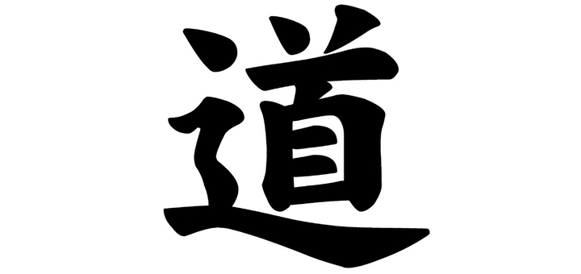

[повернутись](./)

## Дао

Дао ... В наш час цей термін широко використовується у найрізноманітніших сферах діяльності, а термін «філософія Дао»  стає все більш популярним. На жаль, сьогодні часто можна бачити спотворення його істинного розуміння. Щоб зрозуміти, що ж він означає, необхідно звернутися, насамперед, до Даоської Традиції, адже саме в її основі міститься прагнення осягнути Дао й істинну природу реальності.

Дао - це першопричина і виток всього сущого. 
Дао - це Першопочаткова Істинна Реальність, яка існує ніби за гранню нашої реальності, нашого простору, часу і взагалі – поза будь-якими категоріями й формами, якими ми звикли описувати світ навколо нас. Саме на це і вказує перший рядок «Дао Де цзін»: Дао - це не той шлях, що може бути пройдений (названий, описаний у звичних категоріях) - читайте про це далі більш докладно. 

Однак, існуючи за гранню буденного, Дао пронизує весь Всесвіт, існує скрізь, у всьому і завжди, визначаючи принцип існування всього іншого. Адже все існуюче є, по суті, лише одним із проявів Дао. Через свою «потойбічність» Дао неможливо зрозуміти звичайним людським розумом / свідомістю, оскільки свідомість обмежена, а Дао – безмежне в своєму розумінні та проявах. 

Тому будь-яка спроба пояснити за допомогою розуму те, що знаходиться за його межами, не має сенсу і заздалегідь приречена на невдачу. Ця концепція добре показана в фільмі «Матриця» - не можна зрозуміти, що таке Матриця, перебуваючи всередині неї.

Виникає справедливе питання, як же тоді осягнути Дао, якщо свідомість не може допомогти нам у цьому питанні? Справа в тому, що наша свідомість потенційно також безмежна, як і Дао, а обмеження на неї накладаються тією реальністю, в якій ми живемо (Післянебесним аспектом буття). З дитинства ми бачимо цей світ, взаємодіємо з людьми навколо, формуємо свій світогляд, свою особистість, Его, і поступово звикаємо сприймати дійсність через призму тієї картини світу, що вибудувалася в нашій голові. Це і є обмеження. І для осягнення Дао від цього обмеження потрібно відійти, «пробудитися», очистити свою свідомість від Післянебесного, повернувшись до незатьмареності й чистоти своєї Першопочаткової свідомості/Першопочаткового Духу.

Як це зробити? Відповідь на це питання міститься у ще одному значенні терміну Дао - Дао, як Шлях, метод, сукупність практик для трансформації тіла і свідомості людини і набуття нею ... Дао (як Вищої Істини, Першовитоку). Вже в цьому двоякому розумінні терміну Дао помітна характерна риса даоської філософії: відмова від чітких однозначних концепцій, які будуть зайвий раз обмежувати свідомість людини. Замість цього використовуються натяки, своєрідні «вказівники», здатні наблизити людину до правильного розуміння, але тільки в тому випадку, якщо вона не боїться позбутися «твердого грунту» усталених концепцій і припинить чіплятися за «старі капці» звичного світосприйняття. 
Філософія Дао полягає в розумінні його безмежності, неможливості укласти його в заздалегідь окреслені рамки та правила. Тому вона використовує дуже гнучкий підхід до самовдосконалення людини і пояснення різних концепцій. При цьому завжди необхідно пам'ятати про те, що проявлене і висловлене не є остаточною Істиною, це лише спосіб вказати напрямок руху, який потрібний практикуючому тут і зараз, на цьому рівні майстерності. Тому дуже важливо з часом не переплутати «палець з місяцем, на який він вказує».

Пам'ятайте, що будь-яка однозначна концепція (щодо походження світу і людини, щодо того, яким повинен бути Шлях, практика і т. ін.) лише обмежує людину, оскільки Найвище (Дао) не може бути обмеженим і однозначним. Таким чином, якщо ми не будемо прив'язуватися до слів, то будь-яке слово може бути використано для більш глибокого розуміння Дао. Але якщо чіплятися за слова, то ми ніколи не прийдемо до істини, адже завжди будемо обмежені ними.

Розглянемо ієрогліфічне написання Дао, оскільки вже в ньому прихована глибока філософія, розуміння якої грає важливу роль для правильної практики Дао. Ієрогліф складається з 2 частин: лівої та правої. Праву частину, в свою чергу, можна розділити на 2 частини: верхню і нижню.

Верхня права частина означає «єдина Світобудова»; дві рисочки вгорі символізують Інь і Ян. Це значить, що весь Всесвіт (Світобудова) складається з двох полярних сил і, в той же час, залишається цілісним. Нижня права частина означає «я сам» (自), і, якщо уважно придивитися,  можна побачити, що ієрогліф має форму прямокутника, всередині якого - три сектори. Згідно з Даоською традицією, людина («я сам») має три Скарби: Цзин, Ци і Шень, а також три найважливіших енергетичних центри - Даньтяні (нижній, середній і верхній), які символізують різні рівні реальності людського буття. Саме цю триєдність і символізує ієрогліф «я сам», і ця триєдність має бути реалізована за допомогою практики внутрішньої алхімії.

Зверху прямокутника - вертикальна риска, яка розташована точно посередині і сполучає верхній і нижній ієрогліфи. Вона означає, що коли три Скарби з'єднуються і коли відкривається центральний (серединний) канал Чжун май і досягнуто «єдність трьох споконвічних», - відкривається «духовний канал», що дає можливість осягнути «єдину Світобудову». Починаючи з цієї миті, людина і Всесвіт стають єдиним цілим. Адже тільки реалізувавши стан Єдиного Цілого, людина осягає свою Істинну Природу, що і є метою її духовного розвитку.

Поєднавши нижній і верхній ієрогліфи, ми отримуємо новий, що означає «голова» (首). Він  символізує те, що весь світ перебуває «у нас в голові», тобто є породженням нашого розуму / свідомості. З цим твердженням складно навіть примиритися, не кажучи вже про те, щоб осягнути всю його глибину і значення. Ліва частина ієрогліфа Дао перекладається як «рух», «йти із зупинками», «шлях» (辶). Вона відображає другий аспект терміна Дао, як шлях наближення до розуміння Істинної Природи світобудови.

Задавшись питанням «в чому сенс життя?», людина починає шукати Шлях, традицію, яка могла б допомогти їй знайти відповідь. Якщо Шлях обрано правильно, то неофіт починає в першу чергу вивчати себе, розвивати свої фізичну, енергетичну і духовну складові. Продовжуючи вчитись, вона розуміє, що поділ на «Я» і «Природа» є Післянебесною обумовленістю. І тому він слідує по Шляху об'єднання часткового в Єдине Ціле, рухаючись від «гілок до кореня-першовитоку», рухається в зворотному напрямку - від проявленого до першопочаткового. В процесі правильної практики відбувається поєднання трьох зовнішніх сил (Неба, Землі і Людини), і трьох внутрішніх першопочаткових (Цзин, Ци і Шень) в результаті чого людина стає просвітленою істотою, яка позбавлена від будь-яких затемнень і осягає Дао. Той, хто досяг такого рівня реалізації, в Даоській Традиції зветься Істинним Небесним Безсмертним.

Тепер давайте звернемося до одного з найважливіших Даоських трактатів, який шанують у всіх даоських школах. Це «Дао Де цзін» (трактат про Дао і Де), і там в §1 перший рядок говорить про таке: 道可道非常道 - це читається як «ДАО КЕ ДАО ФЕЙ ЧАН ДАО». Зрозуміти, що означає ця фраза, не надто просто не лише нам, але й китайцям, але ми все ж спробуємо трохи її розібрати. «Дао» (道) тут означає «Шлях», який слід пізнати й осягнути в ході внутрішньої практики, а також сам процес руху. «Ке» (可) - означає «може» або «можливість». «Фей» (非) - означає «не», тобто заперечення. «Чан» (常) - означає «постійно». Володіючи цією інформацією, ви можете спробувати самі скласти можливий варіант комбінацій з урахуванням слів-синонімів. 
Після декількох спроб ви побачите, що все не надто просто. Адже просто дослівний переклад тут мало допоможе і необхідний у першу чергу переклад, який передає смислове розуміння того, про що йдеться в цій фразі. А оскільки у кожного перекладача своє розуміння та пріоритети, то і переклади можуть бути різні. При чому кожен з них може бути по-своєму ситуативно правильним. Нижче ми наведемо кілька найпоширеніших варіантів перекладу фрази «Дао ке Дао фей чан Дао»: 
1. Шлях, який можна пройти, не є постійний Шлях. (Торчінов) 
2. В Шляху, по якому можна йти, немає нічого від вічного Дао-Шляху (Торчінов) 
3. «Дао, яке може бути виражене словами, не є постійним Дао». (Ян Хін Шун) 
4. Шлях, що завершується метою, не може Шляхом бути Споконвічним. (Кувшинов) 
5. Обраний Дао - Дао непостійний. (Юй Кан) 
6. Постійний Шлях складається з можливості вибору Шляху і неможливості вибору Шляху. (Віногродський) 
7. Дао, яке може бути висловлено, не є постійне Дао (Лук'янов) 
8. Істину можна виразити незвичайним методом. (Мандрівник) 

Складність при перекладі полягає також у тому, що в давньокитайській мові немає відмін, дієвідмін, конкретного часу та роду, дуже часто відсутні сполучники (а, ніби, начебто, так, навіть, ледь, якщо, ж, і, або, отже, як, якось, коли, чи, або і т.п.). Все це дає величезні можливості для перекладу, де сенс перекладеного може бути як схожим, так і взагалі різним. Тому слід розуміти, що ідеально правильного перекладу тут в принципі бути не може, адже навіть при читанні оригіналу самі китайці можуть розуміти текст по-різному. Тому у всіх Традиційний Школах наголошують на тому, що важливо мати живого Вчителя, який зможе прояснити всі нюанси теорії та філософії, а також те, як їх розуміють у конкретно взятій Школі. 

Внаслідок цього слід пам'ятати, що в Даосизмі існує безліч різних Шкіл зі своїми методологіями та філософською базою, і не можна їх всі звалювати докупи, наївно вважаючи, що скрізь все має бути однаково. Так, наприклад, те, що правильно у Школі Чжен І, може ніколи не використовуватися в Цюань Чжень, і навпаки. Або інший приклад: у Школі Ван Чун'яна і Чжан Бодуаня були зовсім різні підходи і погляди на те, з чого потрібно починати практику, і це при тому, що обидві ці Школи походять від Патріарха Люй Дунбіня. І таких прикладів можна наводити дуже багато. 
А оскільки у нас люди абсолютно не знайомі з історією різних Даоських Шкіл, то вони, дізнавшись позицію однієї Школи, відразу ж наївно вважають, що так має бути і в інших (це стосується не лише практики, але і філософських поглядів на світ, на саму людину, на трактування різних термінів і т.п.) і починають фанатично доводити іншим свою правоту, не розуміючи, що цим вони демонструють лише вузькість власних поглядів. 
Нижче ми наведемо кілька фрагментів з трактату Лао Цзи «Дао Де Цзін», щоб спробувати почути і зрозуміти його бачення Дао: 

**§14**

Переклад Є. Торчінова:

Дивлюся на нього і не бачу - називаю його найтоншим. 
Слухаю його і не чую - називають його найтихішим. 
Ловлю його, але схопити не можу - невловимим його назву. 
Тріаду цю словами пояснити не дано: хаотична вона і єдина. 
Її верх не освітлений, її низ не затемнений. 
Тягнеться-в'ється, але не можна її назвати; знов повертається до відсутності сущого вона. 
Тому кажуть: вигляд поза виглядом, образ поза речами. 
Тому говорять: туманне і невиразне. 
Не бачу початку, коли їй назустріч йду, не бачу кінця, коли слідом за нею поспішаю. 
Тримаюся за давній Шлях-Дао і так управляю сущим нині. 
Можу осягнути давнюю першооснову і підвалинами Дао-Шляху її називаю. 

----------------------------------------------------------------------

Переклад Ян Хін Шуна:

«Дивлюся на нього і не бачу, а тому називаю його невидимим. 
Слухаю його і не чую, тому називаю його нечутним. 
Намагаюся схопити його і не досягаю, тому називаю його найдрібнішим. 
Не треба прагнути дізнатися про джерело цього, тому що це єдине. 
Його верх не освітлений, його низ не затемнений. 
Воно нескінченне і не може бути назване. 
Воно знову повертається до небуття. 
І ось називають його формою без форм, образом без істоти. 
Тому називають його неясним і туманним. 
Зустрічаюся з ним і не бачу обличчя його, слідую за ним і не бачу спини його».

----------------------------------------------------------------------

Переклад А.Лук’янова:

Дивлюся на нього - не бачу, іменем називаю «невидимий». 
Слухаю його - не чую, іменем називаю «беззвучний».  
Ловлю його – не можу схопити, іменем називаю «прихований».  
Ці три не можна розмежувати, тому як змішані  
і утворюють єдине ціле.  
Його верх не світлий, його низ не темний, безперервно в'ється,  
[його] неможливо найменувати.  
[Воно] знайшло притулок в нематеріальному.  
Це і є зображення без зображення, образ без плоті.  
Це і є туманна суміш.  
Іду назустріч йому - не бачу його обличчя (голови).  
Слідую за ним - не бачу його спини (хвоста).  
Тільки неухильно дотримуючись давнього Дао, щоб правити  
нині існуючим, можна пізнати давній початок.  
Це і є уток (нитка, що вказує шлях) Дао.  

----------------------------------------------------------------------

Переклад Б. Віногродського:

Дивишся на нього, не бачачи.  
Іменем назви:  
«Розсіяне».  
Слухаєш його, не чуючи.  
Іменем назви:  
«Розріджене».  
Вхоплюєш його, не втримуючи.  
Іменем назви:  
«Найтонкіше».  
Цю трійцю не можна визначити, ставлячи питання.  
Причинність:  
Змішуючись, здійснюють єдине.  
Під час руху вгору воно не світле.  
Під час руху вниз воно не темне.  
Як нитка, що вислизає.  
Не можна його визначити іменем.  
Повторюється повернення  
в стан відсутності речей.  
Це визначається:  
Трепетне і мерехтливе.  
Рухаєшся йому назустріч, не бачачи його голови.  
Слідуєш за ним, не бачачи його спини.  
Шлях давнини застосовуй  
для контролю наявності даного моменту.  
Володій здатністю знати початок давнини.  
Це визначає: 
Нитка, що вказує шлях. 

**§25**

Переклад Є. Торчінова:

Ось Річ, в Хаосі здійснена, перш Неба і Землі народжена!  
О безмовна! О  безвидна!  
Самотньо стоїш і не змінюєшся, оточуєш все суще і не гинеш!  
Тебе можна назвати Матір'ю Піднебесної.  
Я не знаю твого імені, але, позначаючи знаком, називаю тебе Шляхом-Дао.  
Роблячи зусилля, називаю тебе Великим. 

----------------------------------------------------------------------

Переклад Ян Хін Шуна:

«Ось річ, що у хаосі виникає, перш неба і землі народжена!  
О беззвучна!  
О позбавлена форми!  
Самотньо стоїть вона і не змінюється.  
Всюди діє і не має перешкод.  
Її можна вважати матір'ю Піднебесної.  
Я не знаю її імені.  
Позначаючи ієрогліфом, назву її Дао». 

----------------------------------------------------------------------

Переклад А.Лук’янова:

Є дещо,  яке хаос утворює, перш Неба і Землі живе.  
Беззвучне! Порожнє!  
Самотньо стоїть, не змінюється, в собі самому обертається без утоми.  
Можна вважати його Матір'ю Піднебесної.  
Я не знаю його імені.  
Даю йому прізвисько - називаю Дао.  
Підбираю для нього ім'я - називаю Великим.

----------------------------------------------------------------------

Переклад Б. Віногродського:

Річ проявлена формується з безформного завихрення.  
Народжується перше Неба-Землі.  
У відсутності звуку, в безтурботності.  
Стоїть незалежно, не змінюючись.  
Рухається в циклах, не гинучи.  
Так можна здійснювати начало, що породжує, в Піднебесній.  
Сутність моя не знає цьому імені.  
Позначимо його знаком «Шлях».  
Намагаючись підібрати йому ім'я, визначимо його як «велике». 

**§21**

Переклад Є. Торчінова:

Дао - річ така: неясна і затемнена, безлика і туманна.  
О неясна! О затемнена!  
У твоєму осередді є образи.  
Про безлика! Про туманна!  
У твоєму осередді є речі

----------------------------------------------------------------------

Переклад Ян Хін Шуна:

«Дао туманне і невизначене.  
Проте в його туманності і невизначеності наявні образи.  
Воно туманне і невизначене.  
Проте в його туманності і невизначеності приховані речі». 

----------------------------------------------------------------------

Переклад А.Лук'янова:

Дао є щось туманне, нерозрізнене!  
О, нерозрізнене! О, туманне!  
Усередині Нього містяться образи.  
О, туманне! О, нерозрізнене!  
Усередині Нього містяться речі.  
Переклад Б. Віногродського:  
Шлях реалізується в речах  
лиш як мерехтіння, лиш як тріпотіння.  
Ось тріпотіння, ось мерехтіння.  
А в серцевині - наявність образу.  
Ось мерехтіння, ось тріпотіння.  
А в серцевині - наявність речі.

----------------------------------------------------------------------

*** - український переклад віршованої частини здійснено з російської мови.

[повернутись](./)
