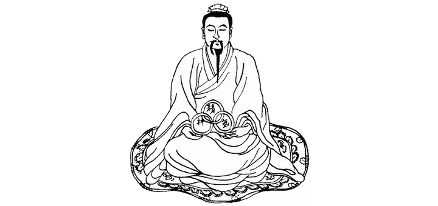

[повернутись](./)

## Три скарби (Три Коштовності)  (三宝 – Сань Бао) 
(_переклад на українську від Олесі_)

В Даоській традиції виділяють Три Коштовності (三宝), які необхідно «захищати» і «вигодовувати». Глибоке розуміння Трьох Скарбів відіграє дуже важливу роль, оскільки вони використовуються як у початкових методах, так і в практиці внутрішньої алхімії. Називаються ці коштовності **Цзін, Ці і Шень**. Тут ми розглянемо базову теорію Трьох Скарбів, щоб читачі могли отримати про неї загальне уявлення. 

### 1 Цзін

Цзін (精) - можна перекласти як «сІм’я» або «сутність». Це особлива субстанція (вид енергії), яка несе в собі інформацію про будову і певні характеристики фізичного тіла людини. На фізичному рівні Цзін дуже тісно пов'язана з ДНК, РНК, гормональними функціями організму (зокрема, з репродуктивною системою), а також зі стовбуровими клітинами. Можна сказати, що Цзін – це сутнісна енергія фізичного тіла.

Вона буває двох видів: Першопочаткова Цзін (Юань Цзін) і звичайна Цзін. Першопочаткову (Переднебесну) Цзін ми отримуємо від батьків при зачатті. Після народження людини, вона, в основному, зберігається в нижньому дяньтяні і в нирках (але наявна в усьому тілі!), а також зв'язана і проявлена у всіх залозах. Людина має обмежену кількість Юань Цзін, і від того, як вона її витрачає, залежить її фізичне здоров'я, і, як наслідок – тривалість життя (це стосується звичайної психічно нормальної людини).

   Втрата Першопочаткової енергії Цзін відбувається під час сильних стресів, при вживанні наркотичних речовин, якщо людина веде надмірне статеве життя, а також вона просто використовується організмом для забезпечення життєдіяльності. Інформація в Цзін може змінюватися під впливом радіаційного випромінення. Практикуючи методи внутрішньої алхімії, можна відновити початковий запас Юань Цзін і усунути ті порушення в організмі, які були викликані її нестачею.
   
   Під звичайною Цзін мається на увазі та, яку ми отримуємо ззовні, її ще називають Післянебесною. Джерелом цього виду енергії більшою мірою є продукти харчування, які ми споживаємо, і, меншою мірою – повітря. Можна сказати, що Цзін – це енергія, яка проявляє себе у вигляді фізичної матерії, і що саме вона відповідає за фізичне тіло і визначає, чи буде людина худою або товстою, колір її очей, волосся і т.п. Цзін може бути як «мертвою» так і «живою».
   
Цзін називають живою, коли в ній наявна життєва сила Ці. Тому, коли йдеться про правильне харчування, всі так радять їсти «живу їжу», в якій ще присутня Ці, щоб отримати максимальну користь від неї. Людське тіло може функціонувати лише за наявності двох видів Цзін, як звичайної, так і Першопочаткової. Але Післянебесна Цзін має нескінченне джерело відновлення (їжа, повітря), на відміну від Переднебесної Цзін. Тому в практиці внутрішньої алхімії основну увагу приділяють Переднебесній Цзін, і, коли говорять про «Цзін», зазвичай мають на увазі саме Юань Цзін. 
Коли йдеться про методи регулювання Цзін, то, на початковому рівні, це може бути саме робота з фізичним тілом, яке також є проявленням Цзін. В даному випадку, робота з тілом означає, що воно має бути в такому стані, при якому можлива глибока внутрішня робота з Ці і Шень. Тобто воно має бути здоровим, гнучким, мати здатність до розслаблення, правильного дихання і т.д.

### 2 Ці 

Ці (氣) – це другий скарб. Тут під Ці мається на увазі життєва енергія (життєва сила), що циркулює в тілі, завдяки якій функціонують всі органи і системи організму. Це саме та сила, яка «змушує» рухатися кров і битися серце. Ці, як і Цзін, буває двох видів: Переднебесна і Післянебесна. Як і у випадку з Юань Цзін, Юань Ці ми отримуємо від батьків, перебуваючи в утробі матері.

Ключовий момент у розвитку Юань Ці відбувається, коли сперматозоїд і яйцеклітина зливаються в одне ціле, що, по суті, є сплавленням Інь і Ян. Таким чином, зароджується нове життя, і Першопочаткова Ці починає рости. Першопочаткову Ці називають ще Переднебесною тому, що ми її отримуємо до того, як побачимо небо. Після народження механізм, який сприяв зростанню і збільшенню кількості Юань Ці, загальмовується і років до 14 повністю зупиняється. Коли Переднебесна Ці закінчується, людина помирає.

Ці Подальшого Неба або Післянебесну енергію ми починаємо отримувати, коли робимо перший вдих і цим активізовуємо меридіан легенів. Тобто це той вид енергії, який ми отримуємо через дихання та харчування (їжа) разом з Цзін. У тілі може відбуватися перетворення Цзін у Ці як мимовільне, так і свідоме, в ході практики. В останньому випадку воно відбувається в нижньому дяньтяні, тому його вважають одним із центрів, в якому зберігається Першопочаткова Ці. Але за підвищення якості та розвиток Ці відповідає середній даньтянь, тому на певному рівні практики, Ці піднімають в середній котел, щоб продовжити вдосконалення у виплавленні.

Післянебесна Ці разом з Юань Ці забезпечує весь організм життєвою силою. В тілі людини існує багато видів Ці, але, загалом, їх можна звести до двох. Перший – захисна Ці (Вей Ци), яка охороняє тіло від негативного впливу навколишнього середовища. Вей Ці виділяється через пори шкіри, і її рух в тілі не пов'язаний з енергетичними каналами. Другий вид – Ін Ці, що означає «живильна (керуюча) енергія». Її функція полягає в забезпеченні органів і систем організму необхідними видами енергії. Ця ж енергія здійснює функцію управління і контролю над фізичними процесами. 

Якщо ж говорити про Ці в більш широкому значенні, то слід усвідомити, що саме енергія є провідником між Людиною і Природою, між фізичним і духовним світом. В цьому випадку Ці слід розглядати, виходячи з її конкретного значення, тому виділяють три рівня або три якісні характеристики цієї енергії. 

* _Перший рівень – природна Ці_. Вона не має певної форми, а також не має певного шляху руху. За допомогою «небесного ока» (тянь му) можна побачити, що ця енергія схожа на туман. Іноді природну Ці можна побачити і звичайним зором, якщо її концентрація досить висока, – наприклад, у приміщенні, де проводиться семінар з Даоських практик.

* _Другий рівень – Ці світла_. Цей різновид Ці має більш високу щільність, ніж природна Ці, і за допомогою «третього ока» сприймається як світловий потік певного кольору. Сприйняттю звичайним зором енергія світла не підлягає.

* _Третій рівень – вища Ці_. Про цей рівень енергії говорити найскладніше, адже вона найбільш «тонка» і складна для розуміння. Скажемо лише, що методи оволодіння цією енергією є великою таємницею Даоської внутрішньої алхімії, а секрет досягнення рівня Істинного Безсмертного полягає саме у використанні вищої Ці для трансформації тіла і свідомості. 

### 3 Шень

Шень (神) – є третім скарбом. Цей термін можна перекласти з китайської як «Душа» або «Дух». Саме Шень наділяє нас розумом, мисленням, здатністю до самовдосконалення. Шень, як і попередні скарби, має два аспекти: Першопочатковий дух (元 神– Юань Шень) і Пізнаючий дух (识 神 - Ши Шень).

**Першопочатковий дух** – це наша Істинна божественна природа, в той час як **Пізнаючий дух** формується після нашого народження під впливом навколишнього світу (виховання, оточення, національна культура тощо). Слід зазначити, що Першопочатковий і Пізнаючий дух тісно пов'язані один з одним і перебувають у постійній взаємодії. В Практичному Даосизмі особливу увагу приділяють осягненню Першопочаткового духу, адже саме він містить всеосяжне знання, на відміну від Пізнаючого духу, знання якого обмежені лише цим втіленням.

Знаходиться Пізнаючий дух (Ши Шень) в серці, домом же Першопочаткового духу є верхній даньтянь. Сам по собі Пізнаючий дух ще поділяють на душі Хунь (魂) і По (魄). Можна навести їх коротке визначення: Душі По співвідносяться з Іньським аспектом Ши Шень, тобто тим, що сприяє притяганню нас до Землі, саме вони тягнуть нас до потурання низьким бажанням і пристрастям. Це – наша тваринна, примітивна частина.

Оскільки вони займають 7 частин свідомості (Пізнаючого духу) з 10, людині набагато легше деградувати, ніж духовно розвиватися. Згідно з Даоською традицією Душі По «живуть» в легенях. У свою чергу Душі Хунь – світла і розумна частина нашої свідомості (Пізнаючого духу). Вони займають 3 частини з 10, і «живуть» у печінці. Однією з цілей внутрішньої алхімії є приборкання і переплавлення Душ По і розвиток Душ Хунь. І тільки тоді ми можемо забезпечити собі хороший фундамент для роботи з Юань Шень (Споконвічним духом).

Як вже стало зрозуміло, Душі Хунь і По – це складові частини Пізнаючого духу, який з'являється в нашому тілі при народженні. Після смерті фізичного тіла Юань Шень і Ши Шень, об'єднавшись, разом відправляються в інший світ (в залежності від карми) і продовжують існувати до того моменту, поки не прийде час втілитися в тілі. Коли ж відбувається втілення, то Ши Шень «стирається» (Хунь розчиняється в Небі, а По в Землі), а після втілення формується новий Пізнаючий дух. Від Пізнаючого духу, після його «утилізації», залишаються кармічні напрацювання і схильності, які переходять з Першопочатковим духом в нове тіло. Однією з цілей практики внутрішньої алхімії є сплавлення Пізнаючого і Першопочаткового духу, що відбувається в стані глибокого Спокою з використанням Першопочаткової Цs і особливих внутрішніх трансформацій.

Оскільки очищення Ши Шень є важливою складовою частиною успіху в практиці, то прийшовши на заняття, ви можете почути такі слова Учителя: «Відкрийте своє серце і свій розум, увійдіть у стан щирості», – адже тільки перебуваючи в цьому стані, можна сприйняти істинні знання і вищу Ці. Не очистивши серце від негативних емоцій і пристрастей, не варто навіть думати про розвиток Юань Шень.

 Коли Юань Шень втілюється в тіло, входить в зародок, то перед цим колишня особистість/індивідуальність (Ши Шень) стирається, і в момент нового втілення відбувається формування нового Пізнаючого духу (особистості/індивідуальності). Коли ми ще перебуваємо в утробі, тобто Переднебесному стані (до того як побачимо небо), Ши Шень є «чистим аркушем», і він не затьмарений мирською обумовленістю. Ши Шень і Юань Шень як би повернені один до одного. 

Коли ж відбувається народження і перехід в Післянебесний стан (після того, як побачимо Небо), то Пізнаючий дух «відвертається» від Юань Шень і обертає свій погляд до зовнішнього світу. Дитина починає пізнавати навколишню реальність за допомогою органів чуття, для того щоб вона могла у ній існувати. Як тільки ми народжуємося, також відбувається активізація всіх наших кармічних властивостей і відбувається вплив Мирського (Післянебесного) на наш Ши Шень, і, в силу цього, його «чистий аркуш» (чистий стан) починає забруднюватися і затьмарюватися обмеженістю зовнішнього світу. При цьому Мирське починає домінувати (займає положення «господаря»), і Першопочаткова Природа Юань Шень не може бути проявлена і  залишається пригніченою (стан «гостя»). 

Практика полягає в тому, щоб очистити Пізнаючий дух від Післянебесних забруднень і затьмарень, видалити всі помилкове і тимчасове і довести його до стану «чистого аркуша». Тільки в такому випадку Юань Шень може бути проявлений і зайняти положення «господаря», а Ши Шень відповідно –  положення «гостя». Пізнаючий дух є нашим людським особистісно-індивідуальним началом. Це начало не може бути знищено (оскільки тоді б ми перетворилися на бездумного ідола, камінь), а може бути лише очищеним від усього помилкового, Післянебесного.

Ши Шень, в ході внутрішньої практики, коли він обертає свій погляд назад, всередину, як це було до народження, і занурюється в стан глибокого спокою (тобто досягає стану «чистого аркуша» без активності, затьмарень і обумовлення) починає осягати Першопочатковий Дух, який за своєю природою є досконалим. Цей процес осягнення називається зустріч (а в подальшому відбувається і сплавлення) Ши Шень і Юань Шень. Тобто ми ніби повертаємося до того стану, який був у нас до народження.

Таким чином, відбувається сплав чистої індивідуальності (людського начала) з Першопочатковим, яке не має конкретної форми і є витоком всього. Саме тому Майстри, які досягли Безсмертя/Просвітлення не є клонами один одного (хоча вони повністю однакові з позиції Першопочаткової Природи Першопочаткового Духу), а проявляють себе по-різному (манера розмови, подача інформації, типові дії та вчинки і т.п.) і ці прояви пов'язані саме з Ши Шень (індивідуальною людською особливістю).

   Ця ідея також виражена і в діаграмах Вень Вана і Фу Сі. Адже різниця між ними лише в розташуванні триграм, а не в тому, що в одній є щось таке, чого немає в іншій. Це саме і означає, що потрібно змінити стан наявного (Пізнаючий і Першопочатковий Дух), а не знищити щось із них. 
Якщо говорити про співвідношення Трьох Скарбів, то Шень серед них займає домінуюче становище, хоча при практиці приділяють увагу врегулюванню та вдосконаленню всіх Трьох Коштовностей. Під регулюванням Цзін мають на увазі роботу з фізичним тілом, тобто суворе дотримання правильного положення при виконанні вправ. Під регулюванням Ці мають на увазі приведення в рівновагу енергії, її вдосконалення (підвищення якості) і, на найпростішому рівні, правильне дихання. При регулюванні Шень важливо, щоб не було сторонніх думок, а також щоб Пізнаючий дух був очищений від затьмарень і невігластва.

Фаза врегулювання є необхідною умовою для правильної практики і передумовою успіху в освоєнні мистецтва внутрішньої алхімії. Лише після того, як фаза врегулювання завершена, можна приступати до фази вдосконалення і виплавлення трьох скарбів. З такими ж етапами підготовки ми зустрічаємося і в повсякденному житті, – наприклад, будь-який музичний інструмент потрібно спочатку налаштувати, відрегулювати, і лише потім грати на ньому, інакше музика не буде гармонійною, а незабаром стане геть нестерпною.

Фаза вдосконалення і виплавлення Трьох Скарбів – це і є «внутрішня алхімія», в якій виділяють декілька ключових моментів:
* Закладання фундаменту – базові практики, які готують людину до практик внутрішньої алхімії. 
* Перший крок – відновлення початкової Цзін і перетворення її в Ці. 
* Другий крок – вдосконалення Юань Ці, використання її для «годування» та підсилення Шень. 
* Третій крок полягає в «пробудженні» і осягненні Першопочаткового Шень і занурення його в стан глибокого спокою (порожнечу) для пізнання Істини. 
* Четвертий крок – руйнування всіх обмежень для повного осягнення Дао.

[повернутись](./)
