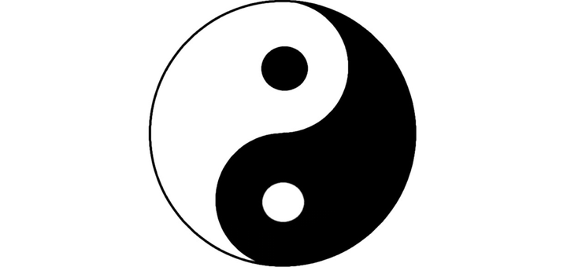

[повернутись](./)

## Теорія Інь-Ян
(_переклад на українську від Олесі_)

Теорія Інь-Ян  - це одна з базових і найдавніших філософських концепцій в Даоській традиції. Незважаючи на те, що зараз важко знайти людину, яка б не чула про цю теорію, насправді мало хто по-справжньому розуміє всю її глибину. 
Така проста на невтаємничений погляд теорія насправді несе глибокий зміст, який полягає в розумінні взаємодії двох споконвічних протилежних сил, з яких складається увесь Всесвіт. Розуміння Інь та Ян надзвичайно важливо для адепта, який опинився на Великому Шляху осягнення своєї Першопочаткової природи, адже саме це дозволить йому будувати свою практику найбільш оптимальним чином і уникнути різних «схиблень» у той чи інший бік.
На сьогоднішній день загального поширення набула діаграма Інь-Ян, яку ще називають Кругом Тайцзи або Кулею Великої Межі (див. мал. у заголовку цієї статті). 
Вона складається з чорної та білої «риб», які симетричні одна одній. При цьому чорна «риба» має біле «око», а біла – чорне. Але, незважаючи на велику популярність цього знаку, варто зауважити, що він є не зовсім коректним у випадку, якщо йдеться про практику «внутрішньої алхімії», і в найдавніших текстах він у такій формі не зустрічається, тому про цю діаграму говорять як про «сучасне (популярне)» зображення. 
Давайте звернемося до історії виникнення цієї діаграми і з’ясуємо, що ж у ній «не зовсім так». Існують точні відомості, що до створення цього символу Інь-Ян доклали руку філософи-неоконфуціанці. 
Розпочався цей процес з Чжоу Дуньї (周敦颐) (1017-1073), який був засновником неоконфуціанства. Саме він та його послідовники почали активно проповідувати абстрактно-відносне розуміння теорії Інь-Ян. Зазвичай Чжоу Дуньї приписують написання трактату "Тайцзи ту шо" ("Пояснення креслення Великої межі") в якому йдеться про співвіднесеність таких концепцій як: У Цзи, Тайцзи, Інь-Ян та У Сін. Фактично текст  являє собою надзвичайно стислий коментар таких давніх даоських текстів як: У цзи ту («План Безмежного»), Тай цзи сянь тянь чжи ту («Переднебесний план Великої межі»), «Шан фан да дун чжень юань мяо цзин ту» («Плани чудесного канону найвищого і найвеличнішого проникнення в істинне начало»). 
Все це викликало багато питань, так що навіть один з відомих сучасників Чжоу Дуньї неоконфуціанець Лу Цзю-юань доводив, що в трактаті «Тайцзи ту шо»  аж надто явно висловлені основні даоські ідеї та викладена первинність У Цзи (Безмежного) по відношенню до Тайцзи (Оформленого), тому зазначений текст не міг написати Чжоу Дуньї – ревний проповідник неоконфуціанства. 

Прототип сучасного зображення діаграми Тайцзи пов’язаний з даоським Майстром Чень Туанем (陳 摶), який був Учителем Чжан Саньфеня (張三丰), творця Тайцзи-цюань. Діаграма Чень Туаня зветься «Сянь тянь тайцзи ту» («План переднебесного Великої межі») і вона не тільки зображувалася таким чином (див. мал. справа), але її й розуміли інакше, ніж трактують сучасне зображення. Тут вкраплення точок означає принцип об'єднання Інь і Ян (і тому вони торкаються одна одної), тобто той результат, якого має бути досягнуто завдяки практиці внутрішньої алхімії. 
Коли ж ця діаграма потрапила до філософа неоконфуціанця Чжу Сі (朱熹) (1130 - 1200), послідовника Чжоу Дуньї, то він змінив не лише її зображення (надавши йому сучасного вигляду), а й філософське розуміння. Тепер вже він прикладав зусилля для поширення своєї нової доктрини. Таким чином, ми бачимо, що всім відомий символ Тайцзи і його тлумачення ввели в загальне користування зовсім не даоси, а саме філософи-неоконфуціанці. Зробити це було не надто складно, так як неоконфуціанство містить в собі ідеї, запозичені з даосизму й буддизму, а отже, ідеї неоконфуціанства могли легко проникати в ці традиції і, певною мірою, змінювати первісне значення і трактування деяких концепцій. Також неоконфуціанство свого часу було визнано в якості основної державної ідеології, тому  її вплив на інші ідеології був дуже й дуже потужним. 
А зараз звергнемося до особливостей діаграми Тайцзи, що належить Чжу Сі. Ключовий момент цієї теорії полягає в тому, що тут розглядається досить абстрактне розуміння концепції Інь і Ян, а також заперечується існування «чистих» сил Інь або Ян. Це заперечення виражено на діаграмі тим, що в чорній «рибі» є біле «око» і навпаки. Тобто ми спостерігаємо тут виключно філософське розуміння світових сил Інь і Ян. Це розуміння, звичайно ж, має право на існування і може бути ефективним у багатьох випадках. 
Але, є одне велике «Але»! І це «але» стає помітним тоді, коли в рамках практики внутрішньої алхімії ми починаємо працювати з енергіями Інь і Ян. Тут ми якраз і стикаємося з тим, що філософія філософією, а реальність може виявитися зовсім іншою, ніж ми собі уявляли. Адже в ході практики ми виявляємо «чисту» енергію Ян без Інь, а також енергію Інь без Ян. 
Щоб краще розуміти, про що йдеться, давайте розглянемо давню даоську діаграму Інь і Ян, яка більш точно відображає відношення між силами Інь і Ян і яку використовував Чжоу Дуньї (див. мал. нижче). Подивившись на цю діаграму, ми бачимо зовсім іншу картину і інші взаємини між двома силами, які вона відображає. І зрозуміти зображене може бути не так вже й просто. 
Ця діаграма є дуже давньою, вона була зроблена в епоху неоліту, а це більш ніж 3000 років до н.е. Тепер давайте розглянемо, в чому ж суть давньої теорії Інь і Ян. На діаграмі ми бачимо, що чорна (Інь) і біла (Ян) смуги симетричні відносно одна одної, і це встановлює баланс двох протилежних начал. Все це закон Природи - так само як день змінює ніч, за вдихом слідує видих, за холодом приходить тепло. 
Також ми бачимо, що сили Інь і Ян існують паралельно і протилежні одна одній. Порожнє коло всередині вказує на Єдине Першопочаткове, з якого все виникає. Ще необхідно сказати те, що самі по собі енергії Інь і Ян не притягуються, як «+» і «-», а, навпаки, відштовхуються. Це пов'язано насамперед з тим, що їхня сила різноспрямована, тобто сила Ян існує в русі від центру до периферії, а сила Інь - від периферії до центру, тому вони не можуть бути з'єднані у звичайному своєму стані. І, тим не менш, у всіх живих (матеріальних) організмах енергії Інь і Ян містяться одночасно,  вони підтримують одна одну, хоча і можуть перебувати в різних пропорціях, а також збиратися в чистому вигляді в окремих ділянках тіла. 
Найпростішим прикладом «чистої» енергії Ян за межами нашого тіла є сонячне світло, а енергії Інь - сила гравітації. При цьому Сонце володіє також і енергією Інь, а в центрі Землі (ядро планети) міститься також енергія Ян. В популярній літературі часто йдеться про те, що Ян - це «сильне», а Інь - «слабке». Але це твердження є помилковим, адже силу гравітації ніяк не можна назвати «слабкою». Слід розуміти, що обидві сили можуть бути в різних станах, як в активному (сильний Ян і Інь), так і пасивному (слабкий Ян і Інь), і саме це розуміння лежить в основі теорії У Сін (п'ять стихій). 
Після всього сказаного ми можемо зробити висновок: в Практичному Даосизмі енергії Інь і Ян - це цілком конкретні сили, а не абстрактні поняття, якими їх вважають у філософських колах. 
Так чи інакше, звичайна людина сприймає світ дуально, є суб'єкт (сама людина) та об'єкти, які її оточують. І ця дуальність є ні що інше, як ті ж самі Інь і Ян. Метою даоської практики є осягнення своєї Першопочаткової природи, яке можливе через досягнення Одного (Єдиного), що означає зникнення подвійності та досягнення цілісної Єдності з усією світобудовою на всіх рівнях, від найгрубішого до найтоншого. 
В Даоській Школі Чжень Дао (як і в інших традиційних даоських напрямках) шлях до набуття Єдності починається з «очищення розуму від забруднень» і «викорінення затьмарень». На рівні роботи з енергією базова методика полягає в тому, що ми осягаємо її якості та властивості Інь і Ян і здійснюємо їх сплавлення (匹配 阴阳). Це дуже непросте завдання, виходячи з того, що енергетичні імпульси сил Інь і Ян різноспрямовані, і тому можна сказати, що Інь і Ян в тілі звичайної людини ніколи самі по собі не можуть злитися воєдино, бо для них це неприродно. Лише завдяки методам внутрішньої алхімії (нейдань), людина може домогтися їхнього з'єднання і використовувати їх одночасно, а не по черзі. Коли відбувається таке поєднання, то людина отримує зовсім інші можливості, а також новий рівень сприйняття реальності. Цей результат можна відобразити в наступних діаграмах (див. малюнки нижче). 
Вона відображає алхімічний результат сплаву Інь і Ян, і зауважте, хоча в першій діаграмі ми бачимо таких само «рибок» як і на «сучасному» накресленні, тільки от ніяких «оченят» у них немає. Алхімічні діаграми добре відбивають динамічні процеси двох протилежних сил, тому можна говорити про існування молодого, зрілого і старого Ян і молодої, зрілої та старої Інь. У звичайної ж людини енергії Інь і Ян не взаємодіють таким об'єднаним чином, як зазначено на малюнках, це характерно тільки для практикуючих внутрішню алхімію. Тому, однією з найважливіших цілей Практичного Даосизму є злиття енергій Інь і Ян, що, по суті, є першим кроком до отримання безсмертя (просвітлення) і осягнення Дао.

[повернутись](./)
